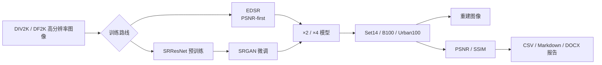

# Super-resolution-unit

一套面向图像超分辨率重建的 PyTorch 训练、评测与交付工具包。项目支持 **×2 / ×4 放大**，内置两条相互独立的算法线：以 PSNR/SSIM 为主要目标的 **EDSR**，以及先训练 **SRResNet**、再通过 **SRGAN** 微调的感知质量路线。

仓库覆盖数据索引、分阶段训练、断点续训、周期评测、最佳模型保存、官方基准测试、重建图像输出和 Markdown/CSV/DOCX 报告生成，适合超分辨率模型实验、对比评测与项目交付。

## ⚠️ 使用前必读

> **不要在需要保留现有训练结果时直接运行 `one_click_retrain.py`、`one_click_retrain.bat` 或任一 `run_full_from_scratch.py`。**

这些入口用于从零重训，会删除或重建目标训练线的 `checkpoints/`、`checkpoints_backup/`、`runs/` 和 `outputs/`。根目录一键脚本默认还会清理两条训练线中的 `.pth` 文件。

- 只想验证项目：运行 `one_click_test_report.py`，它不会清理模型。
- 需要接着训练：在配置中设置 `resume_checkpoint`，然后运行对应的单阶段脚本。
- 确定要从头训练：再使用一键重训或 `run_full_from_scratch.py`。

详细的新手说明见 [客户必读：零基础操作手册](请优先阅读该文档/客户必读_零基础操作手册.md)。

## 项目架构



## 两条算法线

| 训练线 | 目录 | 模型与策略 | 主要目标 | 放大倍率 |
| --- | --- | --- | --- | --- |
| EDSR | `sr30_workspace/` | EDSR，L1 + MSE，余弦学习率与 warmup | PSNR/SSIM 优先 | ×2、×4 |
| SRResNet/SRGAN | `srcnn/` | SRResNet 像素级预训练 → SRGAN 对抗微调 | 兼顾指标与感知质量 | ×2、×4 |

两条线的网络结构和 checkpoint 格式不同，**模型权重不能交叉加载**。

> `srcnn` 是历史目录名，其中当前实现是 SRResNet/SRGAN，并非经典三层 SRCNN。

## 核心能力

- ×2 和 ×4 两种图像超分辨率任务。
- JSON 配置驱动，训练参数、损失、监控与输出路径集中管理。
- 预训练与微调分阶段执行，支持只加载权重或完整恢复训练状态。
- 自动选择 CUDA，CUDA 不可用时回退 CPU。
- 周期保存 checkpoint、镜像备份、历史权重保留和原子写入。
- 训练期间自动在 Set14 上监控 PSNR/SSIM，支持目标值与平台期早停。
- 在 Set14、B100、Urban100 上批量评测并输出超分辨率图像。
- 一键汇总 12 组评测任务，生成 CSV、Markdown 和可选 DOCX 报告。
- 发布 EDSR、SRGAN 的 ×2/×4 最佳权重，使用 Git LFS 管理。

## 目录结构

```text
.
├── models/                    # Git LFS 发布的四个 best checkpoint
├── reports/                   # 一键评测报告
├── sr30_workspace/            # EDSR 独立训练线
│   ├── configs/               # EDSR 训练、微调与评测配置
│   ├── data/                  # 训练数据索引；DF2K 数据本地存放
│   ├── docs/                  # EDSR 维护和算法文档
│   ├── train_psnr_edsr.py     # EDSR 核心训练入口
│   └── eval_psnr_edsr.py      # EDSR 评测与出图
├── srcnn/                     # SRResNet/SRGAN 独立训练线
│   ├── configs/               # 预训练、GAN 微调与评测配置
│   ├── data/                  # 训练数据索引；DF2K 数据本地存放
│   ├── docs/                  # 完整训练、评测和排错文档
│   ├── src/                   # 模型、数据集与公共工具
│   ├── train_srcnn.py         # SRResNet/SRGAN 核心训练入口
│   └── eval.py                # SRResNet/SRGAN 评测与出图
├── setup_official_testsets.py # 安装三套官方测试集
├── one_click_test_report.py   # 一键评测并生成报告（安全）
└── one_click_retrain.py       # 两条算法线从零重训（会清理产物）
```

训练数据、测试集、训练 checkpoint、日志和评测图片默认不提交到 Git，以免仓库体积失控。

## 环境要求

- Python 3.10（推荐）
- PyTorch、TorchVision
- TorchMetrics
- Pillow、OpenCV、Matplotlib
- Einops、TQDM、TensorBoard
- NVIDIA GPU（推荐；CPU 也能运行，但训练和全量评测较慢）
- Git LFS（下载发布模型所必需）

## 安装

```bash
git lfs install
git clone https://github.com/Drmufeng/Super-resolution-unit.git
cd Super-resolution-unit
git lfs pull

python -m venv .venv_shared
```

Windows PowerShell：

```powershell
.\.venv_shared\Scripts\Activate.ps1
python -m pip install --upgrade pip
pip install -r srcnn\requirements.txt
```

Linux/macOS：

```bash
source .venv_shared/bin/activate
python -m pip install --upgrade pip
pip install -r srcnn/requirements.txt
```

如需生成 DOCX 报告，额外安装：

```bash
pip install python-docx
```

检查 `models/*.pth` 是否已由 Git LFS 完整下载。正常文件约为 117–288 MiB；如果只有约 134 字节，说明拿到的是 LFS 指针，请重新执行 `git lfs pull`。

## 使用已发布模型

发布权重位于 `models/`，评测配置则从各训练线的 `checkpoints/` 读取。首次评测前，需要将权重放到配置对应位置。

Windows PowerShell：

```powershell
New-Item -ItemType Directory -Force sr30_workspace\checkpoints\x2 | Out-Null
New-Item -ItemType Directory -Force sr30_workspace\checkpoints\x4 | Out-Null
New-Item -ItemType Directory -Force srcnn\checkpoints\x2 | Out-Null
New-Item -ItemType Directory -Force srcnn\checkpoints\x4 | Out-Null

Copy-Item models\edsr_x2_best.pth sr30_workspace\checkpoints\x2\edsr_x2_best.pth
Copy-Item models\edsr_x4_best.pth sr30_workspace\checkpoints\x4\edsr_x4_best.pth
Copy-Item models\srgan_x2_best.pth srcnn\checkpoints\x2\srgan_x2_best.pth
Copy-Item models\srgan_x4_best.pth srcnn\checkpoints\x4\srgan_x4_best.pth
```

Linux/macOS：

```bash
mkdir -p sr30_workspace/checkpoints/{x2,x4} srcnn/checkpoints/{x2,x4}
cp models/edsr_x2_best.pth sr30_workspace/checkpoints/x2/edsr_x2_best.pth
cp models/edsr_x4_best.pth sr30_workspace/checkpoints/x4/edsr_x4_best.pth
cp models/srgan_x2_best.pth srcnn/checkpoints/x2/srgan_x2_best.pth
cp models/srgan_x4_best.pth srcnn/checkpoints/x4/srgan_x4_best.pth
```

权重大小和 SHA-256 见 [模型清单](models/README.md)。

## 快速评测

### 1. 准备官方测试集

以下命令下载并安装 Set14、B100 和 Urban100 到两条训练线：

```bash
python setup_official_testsets.py
```

也可以使用已有的 `benchmark.tar`：

```bash
python setup_official_testsets.py --archive path/to/benchmark.tar
```

> 安装脚本会替换两个工作区中同名测试集目录。若已有自定义内容，请先备份。

### 2. 生成全量测试报告

```bash
python one_click_test_report.py --mode all
```

只评测一条算法线：

```bash
python one_click_test_report.py --mode sr30
python one_click_test_report.py --mode srcnn
```

同时生成 DOCX：

```bash
python one_click_test_report.py --mode all --with-docx
```

报告写入 `reports/`，并生成便于外部程序处理的 CSV 与便于阅读的 Markdown 文件。

### 3. 运行单项评测

EDSR ×2 / Set14：

```bash
cd sr30_workspace
python eval_psnr_edsr.py --config configs/eval_x2_set14_edsr.json
```

SRGAN ×2 / Set14：

```bash
cd srcnn
python eval.py --config configs/eval_x2_set14.json
```

每张图片会输出 PSNR/SSIM，重建结果保存在配置的 `eval.output_folder` 中。

## 准备训练数据

训练使用 DIV2K/DF2K 高分辨率图像。每条训练线期望如下目录：

```text
data/df2k/
├── DIV2K_train_HR/
└── DIV2K_valid_HR/
```

数据准备完成后，在对应工作区生成索引：

```bash
cd srcnn
python prepare_data_index.py
```

如数据先放在 `srcnn`，可以复制给 EDSR 工作区并生成其索引：

```bash
cd ../sr30_workspace
python prepare_workspace_data.py --copy-df2k
python prepare_data_index.py
```

数据集许可与下载条件以其官方发布页面为准，本仓库不提交原始训练图像。

## 训练

### EDSR 训练线

```bash
cd sr30_workspace

# ×2：预训练后微调
python run_pretrain_x2.py
python run_finetune_x2.py

# ×4：预训练后微调
python run_pretrain_x4.py
python run_finetune_x4.py
```

### SRResNet/SRGAN 训练线

```bash
cd srcnn

# ×2：SRResNet 预训练后进行 SRGAN 微调
python run_pretrain_x2.py
python run_finetune_x2.py

# ×4：SRResNet 预训练后进行 SRGAN 微调
python run_pretrain_x4.py
python run_finetune_x4.py
```

默认配置为预训练 100 epoch、微调 60 epoch、每 20 epoch 保存一次。实际参数以 `configs/*.json` 为准。

### 从零执行完整流程

确认不需要保留目标训练线的历史产物后，才可运行：

```bash
# 根目录：运行两条训练线的 ×2 与 ×4 全流程
python one_click_retrain.py --pipeline all --only all

# 仅 EDSR ×2
python one_click_retrain.py --pipeline sr30 --only x2

# 仅 SRResNet/SRGAN ×4
python one_click_retrain.py --pipeline srcnn --only x4
```

根目录一键训练是“从零流程”，不适合断点续训。

## 断点续训

配置中的两个字段含义不同：

- `init_checkpoint`：只加载模型权重，优化器和 epoch 重新开始。
- `resume_checkpoint`：恢复模型、优化器和 epoch，适合真正接着训练。

EDSR 可以通过阶段选择器恢复最新或最佳 checkpoint：

```bash
cd sr30_workspace
python run_stage_select.py \
  --stage finetune_x4 \
  --select latest \
  --source resume
```

SRResNet/SRGAN 续训步骤：

1. 在对应 `configs/*.json` 中增大 `train.epochs`。
2. 将 `train.resume_checkpoint` 设置为最新或最佳 checkpoint。
3. 清空 `train.init_checkpoint`，避免两者混用。
4. 运行对应的单阶段脚本，例如：

```bash
cd srcnn
python run_finetune_x2.py
```

## 输出说明

| 内容 | EDSR | SRResNet/SRGAN |
| --- | --- | --- |
| 模型权重 | `sr30_workspace/checkpoints/` | `srcnn/checkpoints/` |
| 权重镜像 | `sr30_workspace/checkpoints_backup/` | `srcnn/checkpoints_backup/` |
| 训练/验证日志 | `sr30_workspace/runs/` | `srcnn/runs/` |
| 重建图像 | `sr30_workspace/outputs/` | `srcnn/outputs/` |
| 汇总报告 | `reports/` | `reports/` |

最佳 checkpoint 会在监控指标提升时覆盖更新，历史 epoch 权重的保留数量由 `train.keep_last` 控制。

## 基准结果快照

以下结果来自仓库中的 [测试报告示例](reports/test_report_20260315_180941.md)，测试时间为 2026-03-15。数值是环境与对应 checkpoint 的历史快照，不代表重新训练后的固定结果。

| 模型 | 倍率 | Set14 PSNR/SSIM | B100 PSNR/SSIM | Urban100 PSNR/SSIM |
| --- | --- | --- | --- | --- |
| EDSR | ×2 | 29.4553 / 0.8730 | 26.5443 / 0.8139 | 26.8977 / 0.8712 |
| EDSR | ×4 | 25.0227 / 0.7002 | 25.5177 / 0.7011 | 22.2769 / 0.6846 |
| SRGAN | ×2 | 28.6494 / 0.8493 | 26.5886 / 0.8074 | 26.0166 / 0.8432 |
| SRGAN | ×4 | 24.6336 / 0.6775 | 25.2864 / 0.6840 | 22.0183 / 0.6622 |

## 配置要点

配置文件位于两条训练线各自的 `configs/` 中，主要字段包括：

- `data`：数据目录、裁剪尺寸和放大倍率。
- `model`：生成器、判别器及残差块参数。
- `train`：epoch、batch size、学习率、保存周期和续训权重。
- `loss`：L1、MSE 与对抗损失权重。
- `scheduler`：学习率调度策略（EDSR）。
- `monitor`：评测频率、目标 PSNR、早停耐心值和最小提升量。
- `save_dir` / `backup_dir` / `log_dir`：模型、备份和日志路径。

建议复制现有 JSON 创建新实验，优先通过配置调整参数，避免直接修改核心训练逻辑。

## 文档导航

- [零基础操作手册](请优先阅读该文档/客户必读_零基础操作手册.md)
- [EDSR 工作区说明](sr30_workspace/README.md)
- [EDSR 维护与二次开发](sr30_workspace/docs/维护与二次开发手册.md)
- [SRResNet/SRGAN 工作区说明](srcnn/README.md)
- [训练手册](srcnn/docs/训练手册.md)
- [数据准备手册](srcnn/docs/数据准备手册.md)
- [续训与配置修改指南](srcnn/docs/续训与JSON参数修改指南.md)
- [故障排查手册](srcnn/docs/故障排查手册.md)
- [已发布模型清单](models/README.md)

## License

本项目采用 [MIT License](LICENSE)。

